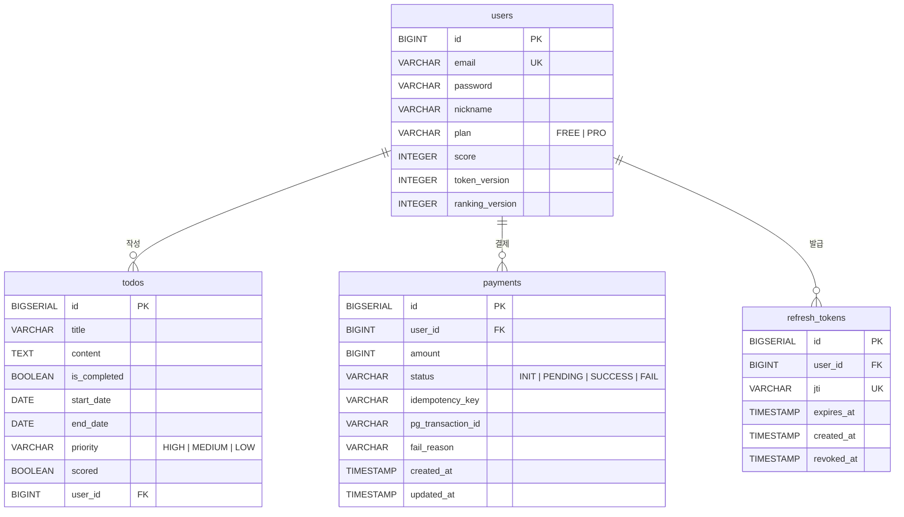

# ERD

## 다이어그램

---

## 설계 의도

### users

| 컬럼 | 설계 의도 |
|------|-----------|
| `plan` | `FREE` / `PRO` 두 가지 플랜을 문자열로 관리합니다. 현재 플랜 종류가 단순하여 별도 테이블로 분리하지 않았습니다. |
| `score` | 랭킹 조회 시 Redis ZSET을 사용하지만, Redis 장애 시 DB가 source of truth 역할을 합니다. 매일 새벽 RankingRebuildJob이 이 값을 기준으로 Redis를 전체 재구성합니다. |
| `token_version` | 비밀번호 변경 등 보안 이벤트 발생 시 증가시켜 모든 디바이스의 Access Token을 일괄 무효화합니다. |
| `ranking_version` | Redis Stream 이벤트의 중복 처리를 방지하기 위한 버전입니다. `token_version`과 목적이 달라 의도적으로 분리했습니다. — 인증 이벤트가 랭킹 deduplication에 영향을 주지 않도록 하기 위함입니다. |

### todos

| 컬럼 | 설계 의도 |
|------|-----------|
| `scored` | 완료 처리 시 점수를 이미 부여했는지 여부를 나타냅니다. 동일한 일정을 여러 번 완료 처리해도 점수가 중복 지급되지 않도록 방어합니다. |
| `start_date` / `end_date` | `end_date` 기준으로 기한 내 완료(+10점) / 기한 초과 완료(+5점)를 구분합니다. |

### payments

| 컬럼 | 설계 의도 |
|------|-----------|
| `idempotency_key` | 클라이언트가 UUID로 생성하여 전송합니다. `(user_id, idempotency_key)` 복합 유니크 인덱스로 중복 결제를 차단합니다. |
| `status` | `INIT → PENDING → SUCCESS / FAIL` 순서로 전이됩니다. `PENDING` 상태를 두는 이유는 처리 중 서버가 재시작될 경우 미완 결제를 식별하고 복구하기 위함입니다. |
| `pg_transaction_id` | PG사가 반환하는 외부 거래 ID입니다. 결제 성공 시에만 기록되며, PG사와의 대사(reconciliation)에 사용됩니다. |

### refresh_tokens

| 컬럼 | 설계 의도 |
|------|-----------|
| `jti` | JWT ID로 UUID를 사용합니다. Refresh Token 자체를 저장하는 대신 JTI만 저장하여 크기를 최소화했습니다. |
| `revoked_at` | `NULL`이면 유효한 토큰입니다. 로그아웃 시 이 값을 기록하여 재사용을 차단합니다. 토큰 재발급(Rotation) 시에도 기존 JTI를 revoke하고 새 토큰을 발급합니다. |
| `ON DELETE CASCADE` | 사용자 탈퇴 시 연관된 Refresh Token을 자동으로 삭제합니다. |
